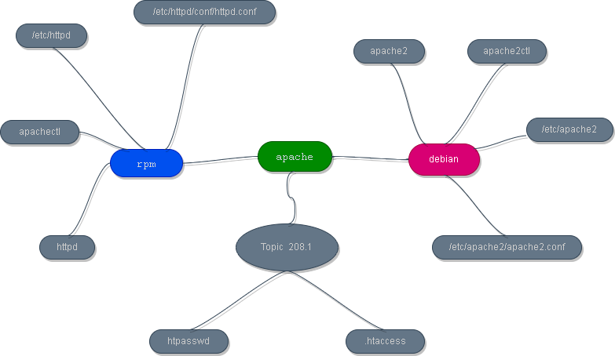
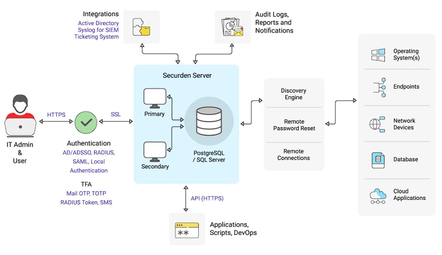
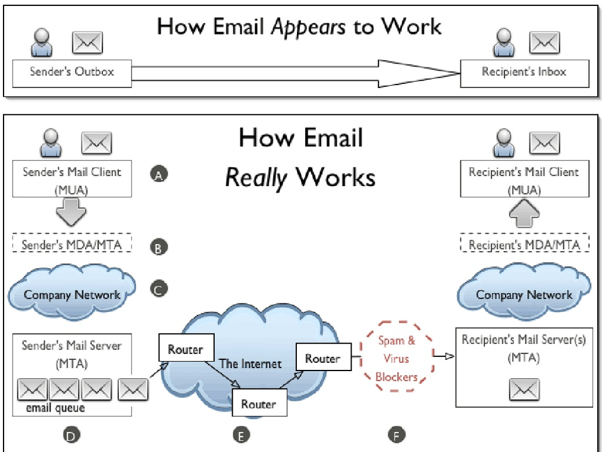
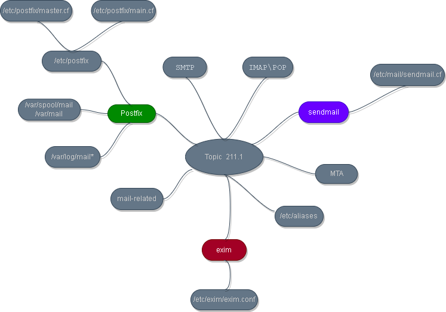
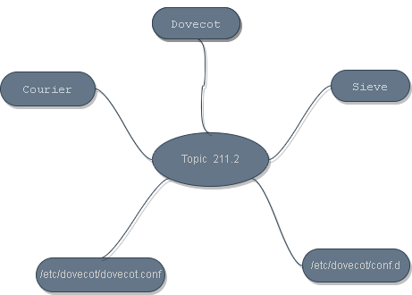
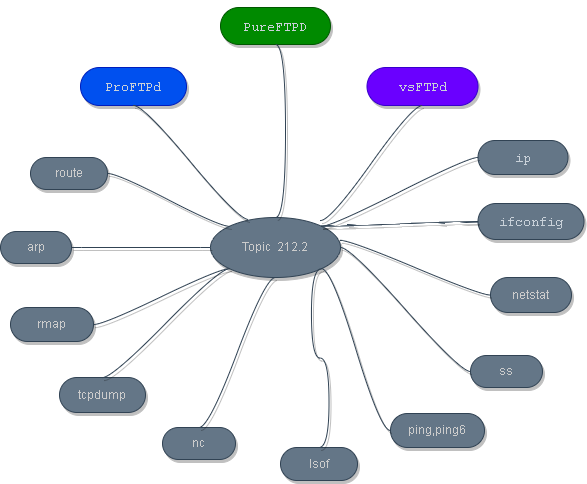

<h1><a name="readme-top"></a></h1>

[](https://github.com/marcossilvestrini/learning-lpic-2-202-450/actions/workflows/check-bind-stack.yml) [](https://github.com/marcossilvestrini/learning-lpic-2-202-450/actions/workflows/check-http-stack.yml) [](https://github.com/marcossilvestrini/learning-lpic-2-202-450/actions/workflows/powershell.yml) [](https://github.com/marcossilvestrini/learning-lpic-2-202-450/actions/workflows/release.yml)

[![MIT License][license-shield]][license-url]
[![Forks][forks-shield]][forks-url]
[![Stargazers][stars-shield]][stars-url]
[![Contributors][contributors-shield]][contributors-url]
[![Issues][issues-shield]][issues-url]
[![LinkedIn][linkedin-shield]][linkedin-url]

# LEARNNING LPIC-2 202-450


<p align="center">
<strong>Explore the docs »</strong></a>
    <br />
    <a href="https://github.com/marcossilvestrini/learning-lpic-2-202-450">Main Page</a>
    -
    <a href="https://github.com/marcossilvestrini/learning-lpic-2-202-450/issues">Report Bug</a>
    -
    <a href="https://github.com/marcossilvestrini/learning-lpic-2-202-450/issues">Request Feature</a>
</p>

## Summary

<details>
  <summary><b>TABLE OF CONTENT</b></summary>
  <ol>
    <li>
      <a href="#about-the-project">About The Project</a>
    </li>
    <li>
      <a href="#getting-started">Getting Started</a>
      <ul>
        <li><a href="#prerequisites">Prerequisites</a></li>
        <li><a href="#instalation">Instalation</a></li>
      </ul>
    </li>
    <li><a href="#usage">Usage</a></li>
    <li><a href="#roadmap">Roadmap</a></li>
    <li><a href="#freedoms">Four Essential Freedoms</a></li>
    <li>
      <a href="#topic-207">Topic 207: Domain Name Server</a>
      <ul>
        <li><a href="#topic-207.1">207.1 Basic DNS server configuration</a></li>
        <li><a href="#topic-207.2">207.2 Create and maintain DNS zones</a></li>
        <li><a href="#topic-207.3">207.3 Securing a DNS server </a></li>
      </ul>
    </li>
    <li>
      <a href="#topic-208">Topic 208: HTTP Services</a>
      <ul>
        <li><a href="#topic-208.1">208.1 Basic Apache configuration</a></li>
        <li><a href="#topic-208.2">208.2 Apache configuration for HTTPS</a></li>
        <li><a href="#topic-208.3">208.3 Implementing Squid as a caching proxy</a></li>
        <li><a href="#topic-208.4">208.4 Implementing Nginx as a web server and a reverse proxy</a></li>
      </ul>
    </li>
    <li>
      <a href="#topic-209">Topic 209: File Sharing</a>
      <ul>
        <li><a href="#topic-209.1">209.1 Samba Server Configuration</a></li>
        <li><a href="#topic-209.2">209.2 NFS Server Configuration</a></li>
      </ul>
    </li>
    <li>
      <a href="#topic-210">Topic 210: Network Client Management</a>
      <ul>
        <li><a href="#topic-210.1">210.1 DHCP configuration</a></li>
        <li><a href="#topic-210.2">210.2 PAM authentication</a></li>
        <li><a href="#topic-210.3">210.3 LDAP client usage</a></li>
        <li><a href="#topic-210.4">210.4 Configuring an OpenLDAP server</a></li>
      </ul>
    </li>
    <li>
      <a href="#topic-211">Topic 211: E-Mail Services</a>
      <ul>
        <li><a href="#topic-211.1">211.1 Using e-mail servers</a></li>
        <li><a href="#topic-211.2">211.2 Managing E-Mail Delivery</a></li>
        <li><a href="#topic-211.3">211.3 Managing Mailbox Access</a></li>
      </ul>
    </li>
    <li>
      <a href="#topic-212">Topic 212: System Security</a>
      <ul>
        <li><a href="#topic-212.1">212.1 Configuring a router</a></li>
        <li><a href="#topic-212.2">212.2 Managing FTP servers</a></li>
        <li><a href="#topic-212.3">212.3 Secure shell (SSH)</a></li>
        <li><a href="#topic-212.4">212.4 Security tasks</a></li>
        <li><a href="#topic-212.5">212.5 OpenVPN</a></li>
      </ul>
    </li>
    <li><a href="#license">License</a></li>
    <li><a href="#contact">Contact</a></li>
    <li><a href="#acknowledgments">Acknowledgments</a></li>
  </ol>
</details><br>

<a name="about-the-project"></a>

## About Project

>This project aims to help students or professionals to learn the main concepts of GNULinux
and free software\
Some GNULinux distributions like Debian and RPM will be covered\
Installation and configuration of some packages will also be covered\
>By doing this you can give the whole community a chance to benefit from your changes.\
>Access to the source code is a precondition for this.\
>Use vagrant for up machines and execute labs and practice content in this article.\
>I have published in folder Vagrant a Vagrantfile with what is necessary\
for you to upload an environment for studies
>
>Thanks *Sue B.V.*, The Netherlands Open Sourced 2021 for content of learning

<p align="right">(<a href="#readme-top">back to top</a>)</p>

<a name="getting-started"></a>

## Getting Started

This is an example of how you may give instructions on setting up your project locally.
To get a local copy up and running follow these simple example steps.

<a name="prerequisites"></a>

### Prerequisites

This is an example of how to list things you need to use the software
and how to install them.

* git
* Virtual Box and extencion
* Vagrant

<a name="instalation"></a>

### Installation

Clone the repo

```sh
git clone https://github.com/marcossilvestrini/learning-lpic-2-202-450.git
```

<a name="usage"></a>

## Usage

Use this repository for get learning about LPIC2 202-450 exam

<p align="right">(<a href="#readme-top">back to top</a>)</p>

<a name="roadmap"></a>

## Roadmap

* [x] Create repository
* [x] Update vagrant box oracle 8 for oracle 9
* [x] Create examples about Topic 207
* [x] Create examples about Topic 208
* [x] Create examples about Topic 209
* [x] Create examples about Topic 210
* [x] Create examples about Topic 211
* [x] Create examples about Topic 212
* [x] Upload simulated itexam

<a name="freedoms"></a>

## Four Essential Freedoms

>0.The freedom to run the program as you wish, for any purpose (freedom 0).\
>1.The freedom to study how the program works, and change it so it does\
your computing as you wish (freedom 1).\
>Access to the source code is a precondition for this.\
>2.The freedom to redistribute copies so you can help others (freedom 2).\
>3.freedom to distribute copies of your modified versions to others (freedom 3).

## Inspect commands

```sh
type COMMAND
apropos COMMAND
whatis COMMAND --long
whereis COMMAND
COMMAND --help, --h
man COMMAND
```

<p align="right">(<a href="#readme-top">back to top</a>)</p>

<a name="topic-207"></a>

## Topic 207: Domain Name Server

<a name="topic-207.1"></a>


### 207.1 Basic DNS server configuration

**Weight:** 3

**Description:**
Description Candidates should be able to configure BIND to function as an
authoritative and as a recursive, caching-only DNS server.
This objective includes the ability to manage a running server and configuring logging.

**Key Knowledge Areas:**

* BIND 9.x configuration files, terms and utilities
* Defining the location of the BIND zone files in BIND configuration files
* Reloading modified configuration and zone files
* Awareness of dnsmasq, djbdns and PowerDNS as alternate name servers

#### 207.1 Cited Objects

```sh
/etc/named.conf
/var/named/
/var/named/named.ca
/etc/bind/db.root
/usr/share/dns/root.hints
rndc
named-checkconf
kill
host
dig
```


#### 207.1 Important Commands

##### rndc - name server control utility

```sh
#Check version\status of bind
rndc status

#Reload /etc/named.conf
rndc reload

#reload zone
rndc reload zone ZONE

#clear cache
rndc flush

#reloads  the  configuration  file and loads new zones
rndc reconfig

#Enable customizade logging
rndc querylog

#Enabled trace
rndc trace
```

##### named-checkconf - named configuration file syntax checking tool

```sh
#check if /etc/named.conf is ok
named-checkconf
```

##### named-checkzone - zone file validity checking or converting tool

```sh
#check if your zone file is ok
named-checkzone lpic2.com.br /var/named/lpic2.zone
```

##### whois - client for the whois directory service

```sh
# find infos about nserver
whois lpi.org
```

#### About BIND - Berkeley Internet Domain Server

##### Install BIND

```sh
#RPM
yum install -y bind bind-utils

#Debian
apt install -y bind9 dnsutils
```

##### Check Status of BIND\named

```sh
#RPM
systemctl status named

#Debian
systemctl status bind9

#Check listen port 53
lsof -n -i :53
lsof -n -i4:53
lsof -n -i6:53
netstat -lutna | grep 53
```

##### Test BIND local

```sh
#localhost, config default
host www.lpi.org localhost
dig  www.lpi.org @localhost

#another ip configurate in listen-on port 53 { 127.0.0.1; 192.168.0.135};
host www.lpi.org 192.168.0.135
dig  www.lpi.org @192.168.0.135
```

#### Add ip for listen on port 53


#### Allow network or ip for remote query


#### Configure DNS Caching Only


<p align="right">(<a href="#topic-207.1">back to sub topic 207.1</a>)</p>
<p align="right">(<a href="#topic-207">back to topic 207</a>)</p>
<p align="right">(<a href="#readme-top">back to top</a>)</p>

<a name="topic-207.2"></a>

### 207.2 Create and maintain DNS zones

**Weight:** 3

**Description:**

Candidates should be able to create a zone file for a forward or reverse
zone and hints for root level servers. This objective includes setting
appropriate values for records, adding hosts in zones and adding zones to
the DNS. A candidate should also be able to delegate zones to another DNS
server.

**Key Knowledge Areas:**

* BIND 9 configuration files, terms and utilities
* Utilities to request information from the DNS server
* Layout, content and file location of the BIND zone files
* Various methods to add a new host in the zone files, including reverse zones

#### 207.2 Cited Objects

```sh
/var/named/
zone file syntax
resource record formats
named-checkzone
named-compilezone
masterfile-format
dig
nslookup
host
```


#### 207.2 Important Commands

##### host - DNS lookup utility

```sh
host www.lpi.org localhost
host www.lpi.org 192.168.0.135
```

##### dig - DNS lookup utility

```sh
dig  www.lpi.org @localhost
dig  www.lpi.org @192.168.0.135
dig -4 @192.168.0.141 lpic2.com.br ANY
```

##### nslookup - query Internet name servers interactively

```sh
nslookup  ol9-bind-caching
nslookup  lpic2.com.br
```

<p align="right">(<a href="#topic-207.2">back to sub topic 207.2</a>)</p>
<p align="right">(<a href="#topic-207">back to topic 207</a>)</p>
<p align="right">(<a href="#readme-top">back to top</a>)</p>

<a name="topic-207.3"></a>

### 207.3 Securing a DNS server

**Weight:** 2

**Description:**

Candidates should be able to configure a DNS server to run as a non-root
user and run in a chroot jail. This objective includes secure exchange of
data between DNS servers.

**Key Knowledge Areas:**

* BIND 9 configuration files
* Configuring BIND to run in a chroot jail
* Split configuration of BIND using the forwarders statement
* Configuring and using transaction signatures (TSIG)
* Awareness of DNSSEC and basic tools
* Awareness of DANE and related records

#### 207.3 Cited Objects

```sh
/etc/named.conf
/etc/passwd
DNSSEC
dnssec-keygen
dnssec-signzone
```


#### 207.3 Important Commands

##### tsig-keygen \ ddns-confgen - ddns key generation tool

```sh
# Generate TSIG key
tsig-keygen lpic2.com.br
```

##### dnssec-keygen - DNSSEC key generation tool

```sh
#Generate DNSSEC key
dnssec-keygen -a ECDSAP256SHA256 -b 1024 -n ZONE lpic2.com.br
```

##### dnssec-signzone

```sh
#Sign DNSSEC key
dnssec-signzone -P -o lpic2.com.br lpic2.zone
```

<p align="right">(<a href="#topic-207.3">back to sub topic 207.3</a>)</p>
<p align="right">(<a href="#topic-207">back to topic 207</a>)</p>
<p align="right">(<a href="#readme-top">back to top</a>)</p>

<a name="topic-208"></a>

## Topic 208: HTTP Services

<a name="topic-208.1"></a>

### 208.1 Basic Apache configuration

**Weight:** 4

**Description:**

Candidates should be able to install and configure a web server.
This objective includes monitoring the server's load and performance,
restricting client user access, configuring support for scripting
languages as modules and setting up client user authentication.
Also included is configuring server options to restrict usage of
resources. Candidates should be able to configure a web server to use
virtual hosts and customise file access.

**Key Knowledge Areas:**

* Apache 2.4 configuration files, terms and utilities
* Apache log files configuration and content
* Access restriction methods and files
* mod_perl and PHP configuration
* Client user authentication files and utilities
* Configuration of maximum requests, minimum and maximum servers and clients
* Apache 2.4 virtual host implementation (with and without dedicated IP addresses)
* Using redirect statements in Apache's configuration files to customise file access

#### 208.1 Cited Objects

```sh
access logs and error logs
.htaccess
httpd.conf
mod_auth_basic, mod_authz_host and mod_access_compat
htpasswd
AuthUserFile, AuthGroupFile
apachectl, apache2ctl
httpd, apache2
```



#### 208.1 Important Commands

##### apachectl

```sh
# start apache
apachectl status

# stop apache
apachectl status

# check apache status
apachectl status

# check apache config
apachectl configtest
```

##### httpd

```sh
# show apache infos
httpd -V

# show apache version
httpd -v
```

##### apache2

```sh
# show apache version
apache2 -v
```

##### htpasswd

```sh
# Create authentication file
echo "vagrant" | htpasswd -c -i /var/www/html/jail-site/.htpasswd vagrant
```

##### Show apache process (Debian\RPM)

```sh
ps aux | grep http
ps aux | grep apache
pstree -p |grep httpd
pstree -p |grep apache2
```

<p align="right">(<a href="#topic-208.1">back to sub topic 208.1</a>)</p>
<p align="right">(<a href="#topic-201">back to topic 208</a>)</p>
<p align="right">(<a href="#readme-top">back to top</a>)</p>

<a name="topic-208.2"></a>

#### About apache Configurations

```sh
# Schema of process up (module mpn_*)
# event
```


```sh
# Configuration file RPM
/etc/httpd/httpd.conf

# Configuration file Debian
/etc/apache2/httpd.conf

# ServerRoot RPM
/etc/httpd

# ServerRoot Debian
/etc/apache2

# Document root (index.html)
/var/www/html

```

### 208.2 Apache configuration for HTTPS

**Weight:** 3

**Description:**

Candidates should be able to configure a web server to provide HTTPS.

**Key Knowledge Areas:**

* SSL configuration files, tools and utilities
* Generate a server private key and CSR for a commercial CA
* Generate a self-signed Certificate
* Install the key and certificate, including intermediate CAs
* Configure Virtual Hosting using SNI
* Awareness of the issues with Virtual Hosting and use of SSL
* Security issues in SSL use, disable insecure protocols and ciphers

#### 201.2 Cited Objects

```sh
Apache2 configuration files
/etc/ssl/, /etc/pki/
openssl, CA.pl
SSLEngine, SSLCertificateKeyFile, SSLCertificateFile
SSLCACertificateFile, SSLCACertificatePath
SSLProtocol, SSLCipherSuite, ServerTokens, ServerSignature, TraceEnable
```


#### 208.2 Important Commands

##### openssl

```sh
# Create Key Pair and certificate signing request(crs)
rm /etc/ssl/certs/lpic2*
openssl req -new -nodes -newkey rsa:4096 \
-passout pass:vagrant \
-subj "/C=BR/ST=SaoPaulo/L=SaoPaulo/O=Silvestrini Inc. /OU=IT Department/CN=lpic2.com.br" \
-keyout /etc/ssl/certs/lpic2.com.br.key -out /etc/ssl/certs/lpic2.com.br.csr 2>/dev/null

# Check crs file
openssl req -in /etc/ssl/certs/lpic2.com.br.csr -text -noout

# Signing Certificates
openssl req -new -x509 -days 30 -nodes -newkey rsa:4096 \
-passout pass:vagrant \
-subj "/C=BR/ST=Sao Paulo/L=Sao Paulo/O=Silvestrini Inc. /OU=IT Department/CN=lpic2.com.br" \
-keyout /etc/ssl/certs/lpic2.com.br.key -out /etc/ssl/certs/lpic2.com.br.crt 2>/dev/null

## Generate client certificate
openssl pkcs12 -password pass:vagrant  -export -in /etc/ssl/certs/lpic2.com.br.crt  \
-password pass:vagrant \
-inkey /etc/ssl/certs/lpic2.com.br.key -out /etc/ssl/certs/lpic2.com.br.p12
```

##### curl

```sh
# Get http_code 
curl -LI http://skynet.lpic2.com.br -o /dev/null -w '%{http_code}\n' -s
curl -LI -k https://skynet.lpic2.com.br -o /dev/null -w '%{http_code}\n' -s

#Get Head
curl --head http://www.lpic2.com.br
curl -k --head https://www.lpic2.com.br

# Trace
curl -v -X TRACE http://www.lpic2.com.br
curl -k -v -X TRACE http://www.lpic2.com.br
```

#### Import Certificates in Firefox

##### Import CA Authority Certificate


<p align="right">(<a href="#topic-208.2">back to sub topic 208.2</a>)</p>
<p align="right">(<a href="#topic-208">back to topic 208</a>)</p>
<p align="right">(<a href="#readme-top">back to top</a>)</p>

<a name="topic-208.3"></a>

### 208.3 Implementing Squid as a caching proxy

**Weight:** 2

**Description:**

Candidates should be able to install and configure a proxy server,
including access policies, authentication and resource usage.

**Key Knowledge Areas:**

* Squid 3.x configuration files, terms and utilities
* Access restriction methods
* Client user authentication methods
* Layout and content of ACL in the Squid configuration files

#### 208.3 Cited Objects

```sh
squid.conf
acl
http_access
```


#### 208.3 Important Commands

##### squid

```sh
# Get squid version
squid -v

# Reconfigure squid
squid -k reconfigure
```

<p align="right">(<a href="#topic-208.3">back to sub topic 208.3</a>)</p>
<p align="right">(<a href="#topic-208">back to topic 208</a>)</p>
<p align="right">(<a href="#readme-top">back to top</a>)</p>

<a name="topic-208.4"></a>

### 208.4 Implementing Nginx as a web server and a reverse proxy

**Weight:** 2

**Description:**

Candidates should be able to install and configure a reverse proxy server,
Nginx.
Basic configuration of Nginx as a HTTP server is included.

**Key Knowledge Areas:**

Nginx
Reverse Proxy
Basic Web Server

#### 208.4 Cited Objects

```sh
/etc/nginx/
nginx
```


#### 208.4 Important Commands

#### nginx

```sh
# get version
nginx -v

# check configuration
nginx -t

# stop nginx
nginx -s stop

# reload configuration
nginx -s reload
```

<p align="right">(<a href="#topic-208.4">back to sub topic 208.4</a>)</p>
<p align="right">(<a href="#topic-208">back to topic 208</a>)</p>
<p align="right">(<a href="#readme-top">back to top</a>)</p>

<a name="topic-209"></a>

## Topic 202: File Sharing

<a name="topic-209.1"></a>

### 209.1 Samba Server Configuration

**Weight:** 5

**Description:**

Candidates should be able to set up a Samba server for various clients.
This objective includes setting up Samba as a standalone server as well as
integrating Samba as a member in an Active Directory. Furthermore, the
configuration of simple CIFS and printer shares is covered. Also covered
is a configuring a Linux client to use a Samba server. Troubleshooting
installations is also tested.

**Key Knowledge Areas:**

* Samba 4 documentation
* Samba 4 configuration files
* Samba 4 tools and utilities and daemons
* Mounting CIFS shares on Linux
* Mapping Windows user names to Linux user names
* User-Level, Share-Level and AD security

#### 209.1 Cited Objects

```sh
smbd, nmbd, winbindd
smbcontrol, smbstatus, testparm, smbpasswd, nmblookup
samba-tool
net
smbclient
mount.cifs
/etc/samba/
/var/log/samba/
```


#### 209.1 Important Commands

##### smbpasswd

```sh
# create user
smbpasswd -a vagrant
yes vagrant|head -n 2|smbpasswd -a -s vagrant

# delete user 
smbpasswd -x vagrant
```

##### pdbedit - manage the SAM database (Database of Samba Users)

```sh
# list samba users
pdbedit -L -v
pdbedit -L
```

##### testparm

```sh
# check samba configurations
testparm -v
```

##### smbclient

```sh
# connect in home samba server
smbclient //debian-server01/vagrant -U vagrant -password vagrant

# list files in home samba server
smbclient -L //debian-server01 -U vagrant
```

##### smbstatus

```sh
# get samba informations
smbstatus
smbstatus -S

# get samba informations in specific user
smbstatus -u vagrant
```

##### nmblookup

```sh
# check status of samba\netbios server
nmblookup -S windows-server
nmblookup -A 192.168.0.100
```

##### samba-tool

```sh
# list samba stack process(pdc,dns,etc)
samba-tool processes
```

##### smbcontrol

```sh
# reload config - smbd,nmbd,winbindd
smbcontrol all reload-config

# stop smbd
smbcontrol smbd shutdown
```

##### net

```sh
# show share of specific user
net -S debian-server01 -U vagrant share
```

##### mount

```sh
# mount cifs remote share linux
mount -t cifs -o username=vagrant,password=vagrant //ol9-server01/vagrant /mnt/ol9-server01

# mount cifs remote filesystem windows
mount -t cifs -o vers=2.0,username=vagrant,password=vagrant //silvestrini/Projetos /mnt/windows-project

# mount NFS remote share linux
mount -t nfs debian-server01:/var/log /mnt/nfs-debian-server01-logs
```

<p align="right">(<a href="#topic-209.1">back to sub topic 209.1</a>)</p>
<p align="right">(<a href="#topic-209">back to topic 209</a>)</p>
<p align="right">(<a href="#readme-top">back to top</a>)</p>

<a name="topic-209.2"></a>

### 209.2 NFS Server Configuration

**Weight:** 3

**Description:**
Candidates should be able to export filesystems using NFS. This objective
includes access restrictions, mounting an NFS filesystem on a client and
securing NFS.

**Key Knowledge Areas:**

* NFS version 3 configuration files
* NFS tools and utilities
* Access restrictions to certain hosts and/or subnets
* Mount options on server and client
* TCP Wrappers
* Awareness of NFSv4

#### 209.2 Cited Objects

```sh
/etc/exports
exportfs
showmount
nfsstat
/proc/mounts
/etc/fstab
rpcinfo
mountd
portmapper
```


#### 209.2 Important Commands

##### showmounts

```sh
# Show NFS mount table
showmount -e
showmount -e debian-server01
```

##### rpcinfo

```sh
# Check NFS server
rpcinfo -p
```

##### exportfs

```sh
# Mount all shares
exportfs -a

# Mount share temporarily
exportfs debian-client01:/opt -o ro,sync

# List mount table
exportfs

# Update mount table
exportfs -r

# Remove mount table
exportfs -ua
```

##### nfsstat

```sh
# List statistcs of NFS server
nfsstat -s

# List statistcs of NFS client
nfsstat -c

# Show mount points
nfsstat -m
```

<p align="right">(<a href="#topic-209.2">back to sub topic 209.2</a>)</p>
<p align="right">(<a href="#topic-202">back to topic 209</a>)</p>
<p align="right">(<a href="#readme-top">back to top</a>)</p>

<a name="topic-210"></a>

## Topic 210: Network Client Management

<a name="topic-210.1"></a>

### 210.1 DHCP configuration

**Weight:** 2

**Description:**
Candidates should be able to configure a DHCP server.
This objective includes setting default and per client options, adding
static hosts and BOOTP hosts. Also included is configuring a DHCP relay
agent and maintaining the DHCP server.

**Key Knowledge Areas:**

* DHCP configuration files, terms and utilities
* Subnet and dynamically-allocated range setup
* Awareness of DHCPv6 and IPv6 Router Advertisements

#### 210.1 Cited Objects

```sh
dhcpd.conf
dhcpd.leases
DHCP Log messages in syslog or systemd journal
arp
dhcpd
radvd
radvd.conf
```


#### 210.1 Important Commands

##### dhclient

```sh
#Release an IP address for the `eth2` interface
dhclient -r eth2

# Get an IP address for the `eth2` interface:
dhclient eth2
```

##### dhcrelay

```sh
#Release an IP address for the `eth2` interface
dhclient -r eth2

# Get an IP address for the `eth2` interface:
dhclient eth2
```

<p align="right">(<a href="#topic-210.1">back to sub topic 210.1</a>)</p>
<p align="right">(<a href="#topic-202">back to topic 210</a>)</p>
<p align="right">(<a href="#readme-top">back to top</a>)</p>

<a name="topic-210.2"></a>

### 210.2 PAM authentication

**Weight:** 3

**Description:**
The candidate should be able to configure PAM to support authentication
using various available methods. This includes basic SSSD functionality.

**Key Knowledge Areas:**

* PAM configuration files, terms and utilities
* passwd and shadow passwords
* Use sssd for LDAP authentication



#### 210.2 Cited Objects

```sh
/etc/pam.d/
pam.conf
nsswitch.conf
pam_unix, pam_cracklib, pam_limits, pam_listfile, pam_sss
sssd.conf
```

#### About PAM

##### Sintaxe configuration Files in /etc/pam.d

```sh
type  control   module <PARAMS>
```

Example /etc/pam.d/nologin:

```sh
auth  required  pam_nologin.so
```

##### Some importants Configs

###### Types

*auth* - check authenticity of user
*account* - check if user can use service
*password* - difines referring updates of authentication
*session* - some procedure what should be done after login,before user grants access

###### Control

*requisite* - if module fail,all process is interrupted
*required* - if module failed, the access is deny, but others modules load with success
*sufficient* -  if module success, others failed modules is ignored. Failed is not fatal
*optional* - success or failed is not relevant.

###### Modules

*pam_unix.so* -  user passwords (passwd\shadow)
*pam_limits.so* -  limitations of ressources
*pam_ldap.so* - access with LDAP
*pam_cracklib.so* - check of weak passwords
*pam_listfile.so* - use of external files for control
*pam_sss.so* - Use SSSD(System Security Services Daemon)
*pam_krb5.so* - Use Kerberos 5 for authentications
*pam_userdb.so* - Use Datafiles .db
*pam_nologin.so* - Use /etc/nologin
*pam_time.so* - Ressources of control per time
*pam_console.so* - Access Control of user console

##### Directory of PAM Modules

###### Debian

`/usr/lib/x86_64-linux-gnu/security/`

###### RPM

`/usr/lib64/security/`


#### 210.2 Importat Commands

```sh
Examples
```

<p align="right">(<a href="#topic-210.2">back to sub topic 210.2</a>)</p>
<p align="right">(<a href="#topic-203">back to topic 210</a>)</p>
<p align="right">(<a href="#readme-top">back to top</a>)</p>

<a name="topic-210.3"></a>

### 210.3 LDAP client usage

**Weight:** 2

**Description:**
Candidates should be able to properly maintain a Linux filesystem using
system utilities.
This objective includes manipulating standard filesystems and monitoring
SMART devices.

**Key Knowledge Areas:**

* LDAP utilities for data management and queries
* Change user passwords
* Querying the LDAP directory

#### 210.3 Cited Objects

```sh
ldapsearch
ldappasswd
ldapadd
ldapdelete
```


#### 210.3 Important Commands

##### ldapadd

```sh
# Add database
ldapadd -a -x -w vagrant -D "cn=admin,dc=lpic2,dc=com,dc=br" -f configs/ldap/lpic2.ldif
```

##### ldapmodify

```sh
# Import\Modify database
ldapmodify -Y EXTERNAL -H ldapi:/// -f configs/ldap/db.ldif

# Modify atribute of dn
ldapmodify -x -w vagrant -D "cn=admin,dc=lpic2,dc=com,dc=br" -f configs/ldap/modify_employee.ldif

# Delete  dn
ldapmodify -x -w vagrant -D "cn=admin,dc=lpic2,dc=com,dc=br" -f configs/ldap/delete_employee.ldif

# Add dn
ldapmodify -x -w vagrant -D "cn=admin,dc=lpic2,dc=com,dc=br" -f configs/ldap/add_employee.ldif
```

##### ldapsearch

```sh
# Find out what backend databases 
ldapsearch -H ldapi:/// -Y EXTERNAL -b "cn=config" -LLL -Q "olcDatabase=*" dn

# Find specific dc
ldapsearch -x -h localhost -b "dc=lpic2,dc=com,dc=br"

# Find specific cn
ldapsearch -x -h localhost -b "dc=lpic2,dc=com,dc=br" cn=Marcos

# Find specific sn
ldapsearch -x -h localhost -b "dc=lpic2,dc=com,dc=br" cn=silvestrini

# Find specific mail
ldapsearch -x -h localhost -b "dc=lpic2,dc=com,dc=br" mail=*carlos*

# Find with logical operator
ldapsearch -x -h localhost -b "dc=lpic2,dc=com,dc=br" "(| (cn=marcos) (cn=carlos))"
ldapsearch -x -h localhost -b "dc=lpic2,dc=com,dc=br" '(& (cn=marcos) (! (sn=Almeida)))'
```

##### ldapdelete

```sh
# Delete entry
ldapdelete -x -w vagrant -h localhost -D "cn=admin,dc=lpic2,dc=com,dc=br" "cn=Carlos1,ou=funcionarios,ou=testes,dc=lpic2,dc=com,dc=br"
```

##### ldapasswd

```sh
# Example
## Creat create cn user 
ldapadd -x -w vagrant -D "cn=admin,dc=lpic2,dc=com,dc=br" -f configs/ldap/user.ldif

## Modify password
ldappasswd -x -w vagrant -h localhost -D "cn=admin,dc=lpic2,dc=com,dc=br" \
  -s newpassword "uid=skynet,ou=funcionarios,ou=suporte,dc=lpic2,dc=com,dc=br"
```

<p align="right">(<a href="#topic-210.3">back to sub topic 210.3</a>)</p>
<p align="right">(<a href="#topic-203">back to topic 210</a>)</p>
<p align="right">(<a href="#readme-top">back to top</a>)</p>

<a name="topic-210.4"></a>

### 210.4 Configuring an OpenLDAP server

**Weight:** 4

**Description:**
Candidates should be able to configure automount filesystems using AutoFS.
This objective includes configuring automount for network and device
filesystems.
Also included is creating filesystems for devices such as CD-ROMs and a
basic feature knowledge of encrypted filesystems.

**Key Knowledge Areas:**

* OpenLDAP
* Directory based configuration
* Access Control
* Distinguished Names
* Changetype Operations
* Schemas and Whitepages
* Directories
* Object IDs, Attributes and Classes

#### 210.4 Cited Objects

```sh
slapd
slapd-config
LDIF
slapadd
slapcat
slapindex
/var/lib/ldap/
loglevel
```


#### 210.4 Important Commands

##### slappasswd

```sh
# Set openlad db password
slappasswd
```

##### slaptest

```sh
# Check openldap configuration
slaptest
slaptest -f /etc/ldap/slapd.conf
```

##### slapcat

```sh
# Check openldap Default database
slapcat -b cn=config

# Check openldap databases
slapcat -f  /etc/ldap/slapd.conf
```

##### slapindex

```sh
# Reindex entries in a SLAPD database
slapindex -f /etc/ldap/slapd.conf
```

<p align="right">(<a href="#topic-210.4">back to sub topic 210.4</a>)</p>
<p align="right">(<a href="#topic-210">back to topic 210</a>)</p>
<p align="right">(<a href="#readme-top">back to top</a>)</p>

<a name="topic-211"></a>

## Topic 211: E-Mail Services

<a name="topic-211.1"></a>



### Default email ports

#### SMTP Ports

The available SMTP ports are four and each of them underlies a different type
of encryption for email sending.

* **25** – This port serves to send messages in plain text, although if the mail server supports it, it can be encrypted with TLS.
Therefore, many Internet service providers block it, as it represents a security risk.

* Port **2525** is an alternative to the SMTP port 25 and can be encrypted over TLS.

* **587** – This is the port IANA registered as the secure SMTP port, and it requires an\
xplicit TLS connection. However, if the email server does not support TLS, the message will
be sent in plain text.

* Port **465** works over an implicit SSL connection and if the server does not support it,\
the operation will be aborted.

#### POP3 ports

* Port **110** is the default POP3 port and it is not encrypted.\

* The encrypted port for POP3 is **995** and works over TLS/SSL.

#### IMAP ports

By default IMAP works on two ports like POP3:

* **143** – this is the default port which does not provide any encryption.\

* Port **993** is the secure port for IMAP and it works over TLS/SSL encryption.

### 211.1 Using e-mail servers

**Weight:** 4

**Description:**
Candidates should be able to manage an e-mail server, including the
configuration of e-mail aliases, e-mail quotas and virtual e-mail domains.
This objective includes configuring internal e-mail relays and monitoring
e-mail servers.

**Key Knowledge Areas:**

* Configuration files for postfix
* Basic TLS configuration for postfix
* Basic knowledge of the SMTP protocol
* Awareness of sendmail and exim

#### Nomenclatures

*SMTP:* Simple Mail Transfer Protocol

*POP3:* Post Office Protocol

*IMAP:* Internet Message Access Protocol

*MTA*: Mail Transfer Agent

*MDA*: Mail Delivery Agent

*MUA*: Mail User Agent

*MX*: Mail Exchange


#### 211.1 Cited Objects

```sh
Configuration files and commands for postfix
/etc/postfix/
/var/spool/postfix/
sendmail emulation layer commands
/etc/aliases
mail-related logs in /var/log/
```



#### 211.1 Important commands

##### postfix

```sh
# Reload postfix configuration
postfix reload

# Start\Stop postfix configuration
postfix start
postfix stop

# Resend mails
postfix flush
```

##### postqueue

```sh
# List the mail queue
postqueue -p
```

##### postmap

```sh
# Set canonical maps
postmap /etc/postfix/send_canonical
```

##### postconf

```sh
# View postfix configuration enable
postconf -d
```

##### postsuper

```sh
# Delete all queued messages
postsuper -d ALL
```

<p align="right">(<a href="#topic-211.1">back to sub topic 211.1</a>)</p>
<p align="right">(<a href="#topic-211">back to topic 211</a>)</p>
<p align="right">(<a href="#readme-top">back to top</a>)</p>

<a name="topic-211.2"></a>

### 211.2  Managing E-Mail Delivery

**Weight:**2

**Description:**
Candidates should be able to implement client e-mail management software
to filter, sort and monitor incoming user e-mail.

**Key Knowledge Areas:**

* Understanding of Sieve functionality, syntax and operators
* Use Sieve to filter and sort mail with respect to sender, recipient(s)headers and size
* Awareness of procmail

#### 211.2 Cited Objects

```sh
Conditions and comparison operators
keep, fileinto, redirect, reject, discard, stop
Dovecot vacation extension
```



<p align="right">(<a href="#topic-211.2">back to sub topic 211.2</a>)</p>
<p align="right">(<a href="#topic-211">back to topic 211</a>)</p>
<p align="right">(<a href="#readme-top">back to top</a>)</p>

<a name="topic-211.3"></a>

### 211.3 Managing Mailbox

**Weight:** 2

**Description:**
Candidates should be able to install and configure POP and IMAP daemons.

**Key Knowledge Areas:**

* Dovecot IMAP and POP3 configuration and administration
* Basic TLS configuration for Dovecot
* Awareness of Courier

#### 211.3  Cited Object

```sh
/etc/dovecot/
dovecot.conf
doveconf
doveadm
```


#### 211.3 Important Commands

##### doveconf

```sh
# View all dovecot configuration
doveconf

# View default  dovecot configuration
doveconf -d

# View only not default dovecot configuration
doveconf -n
```

##### doveadm

```sh
# View dovecot service status
doveadm service status

# View all dovecot configuration
doveadm config

# Reload dovecot configuration
doveadm reload

# List connections
doveadm who

# Test user connection
doveadm auth test vagrant
```

<p align="right">(<a href="#topic-211.3">back to sub topic 211.3</a>)</p>
<p align="right">(<a href="#topic-211">back to topic 211</a>)</p>
<p align="right">(<a href="#readme-top">back to top</a>)</p>

<a name="topic-212"></a>

## Topic 212: System Security

<a name="topic-212.1"></a>

### 212.1 Configuring a router

**Weight:** 3

**Description:**
Candidates should be able to configure a system to forward IP packet and
perform network address translation (NAT, IP masquerading) and state its
significance in protecting a network. This objective includes configuring
port redirection, managing filter rules and averting attacks.

**Key Knowledge Areas:**

* iptables and ip6tables configuration files, tools and utilities
* Tools, commands and utilities to manage routing tables.
* Private address ranges (IPv4) and Unique Local Addresses as well as Link * Local Addresses (IPv6)
* Port redirection and IP forwarding
* List and write filtering and rules that accept or block IP packets based on source or destination protocol, port and address
* Save and reload filtering configurations

#### 212.1 Cited Object

```sh
/proc/sys/net/ipv4/
/proc/sys/net/ipv6/
/etc/services
iptables
ip6tables
```


#### 212.1 Important Commands


##### iptables

```sh
# Show rules in default table (table filter)
iptables -L -n -v

# Show rule sin specific table
iptables -L -n -t nat

# Create a new rule for deny ping for all INPUT
iptables -t filter -A INPUT -p icmp -j DROP
iptables -t filter -A FORWARD -p icmp -j DROP

# Create a new rule for deny ping for specif ip
iptables -t filter -A INPUT -p icmp -d 192.168.0.100 -j DROP

# Create a new rule for allow ping for specif ip
iptables -t filter -A INPUT -p icmp -d 192.168.0.100  -j ACCEPT

#Insert one  or  more rules in the selected chain as the given rule number
iptables -t filter -I INPUT 1 -p icmp -d 192.168.0.100

# Create a new rule for deny specific tcp port for all destination INPUT
iptables -t filter -A INPUT -p tcp --dport 1234 -j  DROP

# Create a new rule for deny specific tcp port for all source INPUT
iptables -t filter -A INPUT -p tcp --sport 1234 -j  DROP

# Delete rule for deny ping for all INPUT
iptables -t filter -D INPUT -p icmp -j DROP

# Clear all rules in specific chain
iptables -F -t filter OUTPUT

# Rule for DROP all in chain INPUT
iptables -P INPUT DROP

# Create SNAT rule in chain POSTROUTING
iptables -t nat -A POSTROUTING -s 172.16.32.0/24 -o eth2 -j SNAT --to-source <YOUR_PUBLIC_IP>
iptables -t nat -A POSTROUTING -s 172.16.32.0/24 -o eth2 -j SNAT --to-source 192.168.0.141
iptables -t nat -A POSTROUTING -s 172.16.32.0/24 -o eth2 -j MASQUERADE

# Create DNAT rule in chain PREROUTING
iptables -t nat -A PREROUTING -p tcp --dport 1234 -j DNAT --to-destination 192.168.0.150:1234
iptables -t nat -A PREROUTING -p tcp --dport 4321 -j DNAT --to-destination 192.168.0.150:1234
iptables -t nat -A PREROUTING -p tcp --dport 6789 -j REDIRECT --to-port 1111
```

##### iptables-save

```sh
# Save actual rules permanently in file
iptables-save  > /etc/iptables.rules
```

##### iptables-restore

```sh
# Restore rules from file
iptables-restore <  /etc/iptables.rules
```

<p align="right">(<a href="#topic-212.1">back to sub topic 212.1</a>)</p>
<p align="right">(<a href="#topic-212">back to topic 205</a>)</p>
<p align="right">(<a href="#readme-top">back to top</a>)</p>

<a name="topic-212.2"></a>

### 212.2 Managing FTP servers

**Weight:** 2

**Description:**
Candidates should be able to configure an FTP server for anonymous
downloads and uploads. This objective includes precautions to be taken if
anonymous uploads are permitted and configuring user access.

**Key Knowledge Areas:**

* Configuration files, tools and utilities for Pure-FTPd and vsftpd
* Awareness of ProFTPd
* Understanding of passive vs. active FTP connections

#### 212.2 Cited Objects

```sh
ip
ifconfig
route
arp
ss
netstat
lsof
ping, ping6
nc
tcpdump
nmap
```



#### 212.2 Important Commands

##### ftp

```sh
# conenct in ftp server
ftp <IP_FTP_SERVER>
```

<p align="right">(<a href="#topic-212.2">back to sub topic 212.2</a>)</p>
<p align="right">(<a href="#topic-212">back to topic 212</a>)</p>
<p align="right">(<a href="#readme-top">back to top</a>)</p>

<a name="topic-212.3"></a>

### 212.3 Secure shell

**Weight:** 4

**Description:**
Candidates should be able to identify and correct common network setup
issues,to include knowledge of locations for basic configuration files and
commands.

**Key Knowledge Areas:**

* OpenSSH configuration files, tools and utilities
* Login restrictions for the superuser and the normal users
* Managing and using server and client keys to login with and without password
* Usage of multiple connections from multiple hosts to guard against loss
of connection to remote host following configuration changes

#### 212.3 Cited Objects

```sh
ssh
sshd
/etc/ssh/sshd_config
/etc/ssh/
Private and public key files
PermitRootLogin, PubKeyAuthentication, AllowUsers,
PasswordAuthentication, Protocol

```


#### 212.3 Important Commands

##### ssh

```sh
# Connect in the server - verbose mode
ssh -v vagrant@debian-server01

# Generate keys
ssh-keygen -q -t ecdsa -b 521 -f ~/.ssh/my_ecdsa_keys

# Send public key for remote server
ssh-copy-id vagrant@debian-client01

# Use private key whith password
## start ssh-agent
ssh-agent
## add key in safe
ssh-add # enter your pass
## connect in server
ssh user@server

# create ssh tunnel
ssh -N -f -L 4321:debian-client01:1234 vagrant@debian-client01
```

<p align="right">(<a href="#topic-212.3">back to sub topic 212.3</a>)</p>
<p align="right">(<a href="#topic-212">back to topic 212</a>)</p>
<p align="right">(<a href="#readme-top">back to top</a>)</p>

<a name="topic-212.4"></a>

### 212.4 Security tasks

**Weight:**3

**Description:**
Candidates should be able to receive security alerts from various sources,
install, configure and run intrusion detection systems and apply security
patches and bugfixes.

**Key Knowledge Areas:**

* Tools and utilities to scan and test ports on a server
* Locations and organisations that report security alerts as Bugtraq, CERT
or other sources
* Tools and utilities to implement an intrusion detection system (IDS)
* Awareness of OpenVAS and Snort

#### 212.4 Cited Objects

```sh
telnet
nmap
fail2ban
nc
iptables
```


#### 212.4 Important Commands

##### telnet

```sh
# Test local port connection
telnet localhots 22

# Test remote port connection
telnet debian-client01 22
```

##### nc

```sh
# Test local port connection
nc localhots 22

# Test remote port connection
nc debian-client01 22

# open and listen local tcp connection in specific port
nc -k -l -p 1234
```

##### netstat

```sh
# List tcp connections in listen
netstat --tcp --listen
netstat -tln


# List udp connections in listen
netstat --udp --listen
netstat -uln

# List listen connections and process
netstat -nalp | grep 22
```

##### nmap

```sh
# scan ports 1-22 in localhost
nmap -sT -p1-22 localhost

# scan ports 1-22 in remote server
nmap -sT -p21-22 debian-client01

# Get system operation information
nmap -O localhost

# Generate general report
nmap -A ol9-server01
```

<p align="right">(<a href="#topic-212.4">back to sub topic 212.4</a>)</p>
<p align="right">(<a href="#topic-212">back to topic 212</a>)</p>
<p align="right">(<a href="#readme-top">back to top</a>)</p>

<a name="topic-212.5"></a>

### 212.5 OpenVPN

**Weight:** 2

**Description:**
Candidates should be able to configure a VPN (Virtual Private Network) and
create secure point-to-point or site-to-site connections.

**Key Knowledge Areas:**

* OpenVPN

#### 212.5 Cited Objects

```sh
/etc/openvpn/
openvpn
```


#### 212.5 Important Commands

##### openvpn

```sh
# generate key par 
openvpn --genkey secret static.key

#Connect in VPN with device type  tun
## Start server
cd /etc/openvpn && openvpn --config /etc/openvpn/server.conf --daemon

## Start client
cd /etc/openvpn && openvpn --config /etc/openvpn/client.conf --daemon
```

<p align="right">(<a href="#topic-212.5">back to sub topic 212.5</a>)</p>
<p align="right">(<a href="#topic-212">back to topic 212</a>)</p>
<p align="right">(<a href="#readme-top">back to top</a>)</p>

## Contributing

Contributions are what make the open source community such an amazing place to
learn, inspire, and create. Any contributions you make are **greatly appreciated**.

If you have a suggestion that would make this better, please fork the repo and
create a pull request. You can also simply open an issue with the tag "enhancement".
Don't forget to give the project a star! Thanks again!

1. Fork the Project
2. Create your Feature Branch (`git checkout -b feature/AmazingFeature`)
3. Commit your Changes (`git commit -m 'Add some AmazingFeature'`)
4. Push to the Branch (`git push origin feature/AmazingFeature`)
5. Open a Pull Request

## License

* This project is licensed under the MIT License * see the LICENSE.md file for details

## Contact

Marcos Silvestrini - marcos.silvestrini@gmail.com \
[](https://twitter.com/mrsilvestrini)

Project Link: [https://github.com/marcossilvestrini/learning-lpic-2-202-450](https://github.com/marcossilvestrini/learning-lpic-2-202-450)

<p align="right">(<a href="#readme-top">back to top</a>)</p>

## Acknowledgments

* [Richard Stallman's](http://www.stallman.org/)
* [GNU/Linux FAQ by Richard Stallman](https://www.gnu.org/gnu/gnu-linux-faq.html)
* [GNU](https://www.gnu.org/)
* [GNU Operating System](https://www.gnu.org/gnu/thegnuproject.html)
* [GCC Compiler](https://gcc.gnu.org/wiki/History)
* [GNU Tar](https://www.gnu.org/software/tar/)
* [GNU Make](https://www.gnu.org/software/make/)
* [GNU Emacs](https://en.wikipedia.org/wiki/Emacs)
* [GNU Packages](https://www.gnu.org/software/)
* [GNU/Linux Collection](https://directory.fsf.org/wiki/Collection:GNU/Linux)
* [GNU Grub Bootloader](https://www.gnu.org/software/grub/)
* [GNU Hurd](https://www.gnu.org/software/hurd/hurd/what_is_the_gnu_hurd.html)
* [Kernel](https://www.kernel.org/)
* [Linux Kernel Man Pages](https://www.kernel.org/doc/man-pages/)
* [Linux Standard Base](https://en.wikipedia.org/wiki/Linux_Standard_Base)
* [Filesystem Hierarchy Standard](https://en.wikipedia.org/wiki/Filesystem_Hierarchy_Standard)
* [File Hierarchy Structure](https://refspecs.linuxfoundation.org/FHS_3.0/fhs-3.0.pdf)
* [FSF](https://www.fsf.org)
* [Free Software Directory](https://directory.fsf.org/wiki/Free_Software_Directory:Free_software_replacements)
* [Free Software](https://www.gnu.org/philosophy/free-sw.html)
* [Copyleft](https://www.gnu.org/licenses/copyleft.en.html)
* [GPL](https://www.gnu.org/licenses/quick-guide-gplv3.html)
* [GNU Lesser General Public License](https://www.gnu.org/licenses/lgpl-3.0.html)
* [BSD](https://opensource.org/licenses/BSD-3-Clause)
* [Open Source Initiative](https://opensource.org/)
* [Creative Commons](https://creativecommons.org/)
* [License LTS](https://en.wikipedia.org/wiki/Long-term_support)
* [Debian Free Software Guidelines](https://www.debian.org/social_contract#guidelines)
* [X11 Org](https://www.x.org/wiki/)
* [Wayland](https://wayland.freedesktop.org/)
* [GNU GNOME](https://www.gnu.org/press/gnome-1.0.html)
* [GNOME](https://www.gnome.org/)
* [XFCE](https://xfce.org/)
* [KDE Plasma](https://kde.org/plasma-desktop/)
* [Harmony](https://en.wikipedia.org/wiki/Harmony_(toolkit))
* [xRDP](https://bytexd.com/xrdp-centos/)
* [NTP](https://www.ntppool.org/en/)
* [Bourne Again Shell](https://www.gnu.org/software/bash/manual/)
* [Shebang](https://bash.cyberciti.biz/guide/Shebang)
* [Environment Variables](https://linuxize.com/post/how-to-set-and-list-environment-variables-in-linux/)
* [GNU Globbing](https://man7.org/linux/man-pages/man7/glob.7.html)
* [Globbing](https://linuxhint.com/bash_globbing_tutorial/)
* [Quoting](https://www.gnu.org/software/bash/manual/html_node/Quoting.html)
* [Regular Expressions](https://www.gnu.org/software/grep/manual/html_node/Regular-Expressions.html)
* [List Linux Distribution](https://en.wikipedia.org/wiki/List_of_Linux_distributions)
* [Distro Watch](https://distrowatch.com/)
* [Comparison Linux Distributions](https://en.wikipedia.org/wiki/Comparison_of_Linux_distributions)
* [Download Packages](https://pkgs.org/)
* [Install Packages](https://installati.one/)
* [Guide Install Packages](https://installati.one/)
* [Bugzila](https://bugzilla.kernel.org/)
* [Command Not Found](https://command-not-found.com/)
* [DistroTest](https://distrotest.net/index.php)
* [Bash RC Generator](http://bashrcgenerator.com/)
* [Explainshell](https://explainshell.com/)
* [Vim Tutorial](https://www.openvim.com/)
* [Linux Shell Scripting Tutorial](https://bash.cyberciti.biz/guide/Main_Page)
* [Github Badges](https://github.com/alexandresanlim/Badges4-README.md-Profile)
* [Commands Examples](https://www.geeksforgeeks.org/)
* [Compile Your Kernel](https://wiki.linuxquestions.org/wiki/How_to_build_and_install_your_own_Linux_kernel)
* [Bind](https://www.isc.org/bind/)
* [Bind Logging](https://www.zytrax.com/books/dns/ch7/logging.html)
* [List of DNS record types](https://en.wikipedia.org/wiki/List_of_DNS_record_types)
* [List of DNS record types](https://en.wikipedia.org/wiki/List_of_DNS_record_types)
* [W3Techs](https://w3techs.com/)
* [Apache](https://www.apache.org/)
* [Apache Directives](https://httpd.apache.org/docs/2.4/mod/directives.html)
* [HTTP Status Codes](https://en.wikipedia.org/wiki/List_of_HTTP_status_codes)
* [Strong Ciphers for Apache, nginx and Lighttpd](https://cipherlist.eu/)
* [SSL Tutorials](https://www.golinuxcloud.com/blog/)
* [SSL Config Mozilla](https://ssl-config.mozilla.org/)
* [LPIC-2 202-450 Objectives](https://www.lpi.org/our-certifications/exam-202-objectives)
* [LPIC-2 202-450 Wiki](https://wiki.lpi.org/wiki/LPIC-2_Objectives_V4.5#Objectives:_Exam_202)
* [LPIC-2 202-450 Learning Material](https://lpic2book.github.io/src/)
* [LPIC-2 202-450 Simulated Exam By ITexams](https://www.itexams.com/exam/202-450)

<p align="right">(<a href="#readme-top">back to top</a>)</p>

<!-- MARKDOWN LINKS & IMAGES-->
<!-- https://www.markdownguide.org/basic-syntax/#reference-style-links -->
[contributors-shield]: https://img.shields.io/github/contributors/marcossilvestrini/learning-lpic-2-202-450.svg?style=for-the-badge
[contributors-url]: https://github.com/marcossilvestrini/learning-lpic-2-202-450/graphs/contributors
[forks-shield]: https://img.shields.io/github/forks/marcossilvestrini/learning-lpic-2-202-450.svg?style=for-the-badge
[forks-url]: https://github.com/marcossilvestrini/learning-lpic-2-202-450/network/members
[stars-shield]: https://img.shields.io/github/stars/marcossilvestrini/learning-lpic-2-202-450.svg?style=for-the-badge
[stars-url]: https://github.com/marcossilvestrini/learning-lpic-2-202-450/stargazers
[issues-shield]: https://img.shields.io/github/issues/marcossilvestrini/learning-lpic-2-202-450.svg?style=for-the-badge
[issues-url]: https://github.com/marcossilvestrini/learning-lpic-2-202-450/issues
[license-shield]: https://img.shields.io/github/license/marcossilvestrini/learning-lpic-2-202-450.svg?style=for-the-badge
[license-url]: https://github.com/marcossilvestrini/learning-lpic-2-202-450/blob/master/LICENSE
[linkedin-shield]: https://img.shields.io/badge/-LinkedIn-black.svg?style=for-the-badge&logo=linkedin&colorB=555
[linkedin-url]: https://linkedin.com/in/marcossilvestrini
